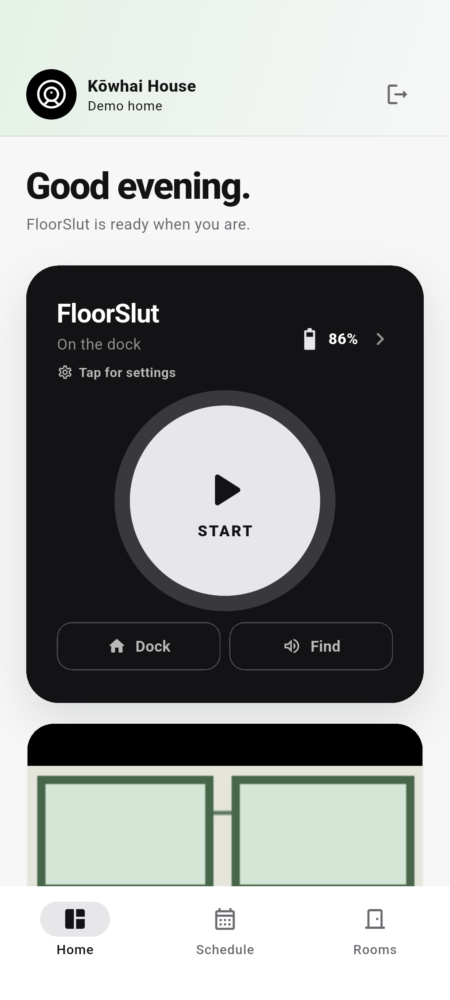
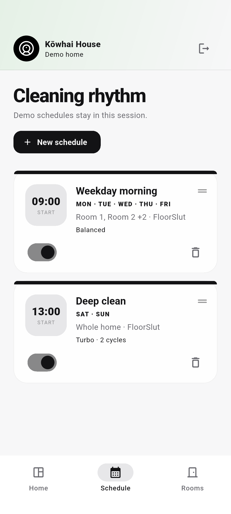
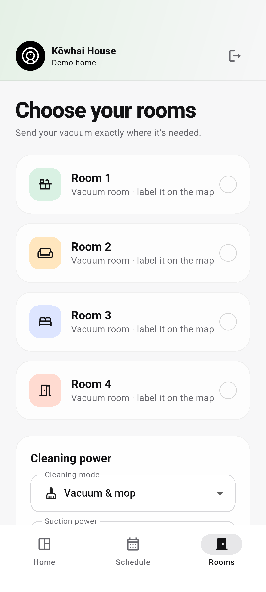
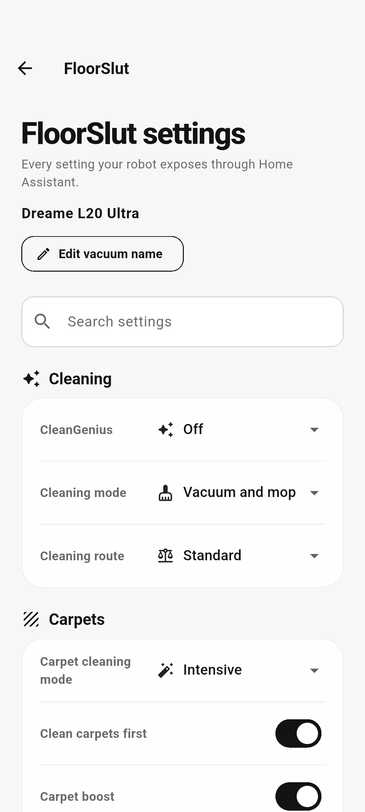
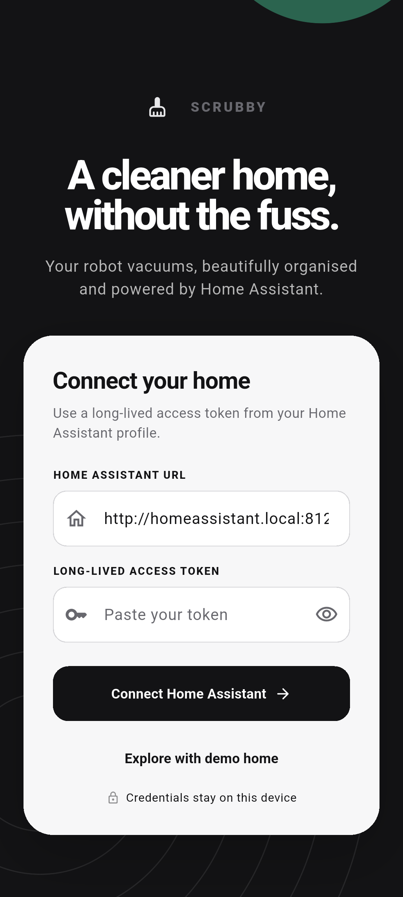

<div align="center">
  

# Scrubby

**Your robot vacuum, without the smart-home clutter.**

Scrubby is a focused, beautiful Home Assistant companion for robot vacuums—built for quick cleaning controls, live status, rooms, maps, schedules, and robot settings.

<p>
  <a href="https://github.com/brandonp2412/Scrubby/releases/latest"></a>
  <a href="https://github.com/brandonp2412/Scrubby/blob/main/LICENSE"></a>
</p>
</div>

## Clean without the clutter

- Start, pause, return to base, and locate compatible robot vacuums
- See live cleaning state, battery level, fan speed, and compatible floor maps
- Label rooms and launch supported room-cleaning actions
- Create and manage cleaning schedules
- Control model-specific settings exposed by Home Assistant
- Receive Android notifications for supported Dreame cleaning, consumable, information, warning, and error events
- Connect directly to your Home Assistant server—Scrubby has no cloud service, ads, or analytics
- Explore the complete interface with demo data before connecting a real home

## Screenshots

<p align="center">
  
  
  
</p>
<p align="center">
  
  
</p>

## Get Scrubby

Scrubby is released and tested for **Android, Linux, Windows, and the web**. Apple platforms are not currently supported.

Download packaged builds from the [latest GitHub release](https://github.com/brandonp2412/Scrubby/releases/latest), or build from source:

```sh
flutter pub get
flutter run
```

Choose **Explore with demo home** to try Scrubby without a server. To connect a real installation, enter your Home Assistant URL and a long-lived access token created at **Home Assistant → Profile → Security → Long-lived access tokens**.

## Home Assistant integration

Scrubby authenticates with Home Assistant's WebSocket API, discovers every `vacuum.*` entity, and subscribes to the event bus so vacuum state, battery, fan speed, and compatible camera/image maps stay live. REST is used for the latest map image bytes and standard service calls:

- `vacuum.start`
- `vacuum.pause`
- `vacuum.return_to_base`
- `vacuum.locate`

### Rooms and segment cleaning

Room labels are Scrubby map metadata stored securely on the device and scoped to each vacuum. They do not create Home Assistant Areas.

For vacuums supporting Home Assistant's `CLEAN_AREA` capability, Scrubby discovers real rooms with `vacuum/get_segments`, binds labels to segment IDs, and discovers the installed integration's segment-cleaning service when a manual clean starts. This supports Dreame's `dreame_vacuum.vacuum_clean_segment` service and equivalent `clean_segment` service shapes used by other integrations.

Scrubby never substitutes a whole-home `vacuum.start` when room cleaning is unavailable. Because map images do not contain standard room geometry, the labelling dialog asks which reported vacuum room is under the tapped point.

### Robot settings

Scrubby discovers robot settings from Home Assistant's entity registry by matching the vacuum's device ID. Every enabled `switch`, `select`, `number`, and `button` entity on that device is rendered with its native control.

That gives compatible Dreame robots model-aware access to carpet cleaning mode, clean-carpets-first, carpet boost, cleaning route, mop and dock preferences, maintenance actions, and newer options the integration adds without requiring a Scrubby update. Entities disabled in Home Assistant must be enabled there before Scrubby can control them.

The Home Assistant integration boundary lives in `lib/core/home_assistant.dart`.

## Dreame notifications

Scrubby listens for all five event families emitted by the Dreame Home Assistant integration: `task_status`, `consumable`, `information`, `warning`, and `error`.

Android delivers them through separate notification channels for cleaning activity, consumables, robot information, warnings, and errors, so each category can be configured independently. Notification permission is requested after Home Assistant connects.

When Scrubby is backgrounded on Android, a `remoteMessaging` foreground service keeps an authenticated Home Assistant WebSocket alive in its own Dart isolate, reconnects using securely stored credentials, and posts the same category-specific notifications. Android shows a small, low-priority **Scrubby connection** status notification while monitoring is active. Stopping or force-stopping Scrubby stops delivery.

For Flutter web, Home Assistant must allow Scrubby's origin in `http.cors_allowed_origins`. Mobile builds support both local HTTP Home Assistant instances and remote HTTPS instances.

## Development

Run the standard quality checks with:

```sh
flutter analyze
flutter test
flutter build web
flutter build appbundle --release
```

Android notification end-to-end tests use Patrol and a disposable emulator or test device. Patrol clears Scrubby's app data to isolate each test, so do not run them on a device whose saved Home Assistant connection you need:

```sh
flutter pub global activate patrol_cli
patrol test --target patrol_test/notifications_test.dart
```

See [CONTRIBUTING.md](CONTRIBUTING.md) for the supported toolchain and local release-signing setup.

## Screenshot generation

Generate the complete Fastlane screenshot set for phone, 7-inch tablet, 10-inch tablet, and desktop with Waydroid and Chrome:

```sh
scripts/screenshots-waydroid.sh
```

Pass a dimension such as `phoneScreenshots`, `sevenInchScreenshots`, `tenInchScreenshots`, or `desktop` to regenerate only that target. A second argument can select one screenshot by number or test name:

```sh
scripts/screenshots-waydroid.sh phoneScreenshots 1
```

Android output is written to Fastlane's Play metadata folders and desktop output to `fastlane/screenshots`. The runner requires Waydroid, ADB, `dwl`, ChromeDriver, and passwordless `sudo` for Waydroid administration.

## Privacy, security, and support

Scrubby connects directly to the Home Assistant server you choose. See [PRIVACY.md](PRIVACY.md) for data handling and [SECURITY.md](SECURITY.md) for vulnerability reporting.

Use the [issue tracker](https://github.com/brandonp2412/Scrubby/issues) for reproducible bugs and feature requests. Do not include Home Assistant URLs, access tokens, maps, or other private household data in reports.

Scrubby is maintained by its contributors. Contributions are welcome under the [MIT License](LICENSE).

## Trademarks and affiliation

Scrubby is an independent project and is not affiliated with, endorsed by, or sponsored by Home Assistant or Dreame. Home Assistant and Dreame are trademarks of their respective owners.
