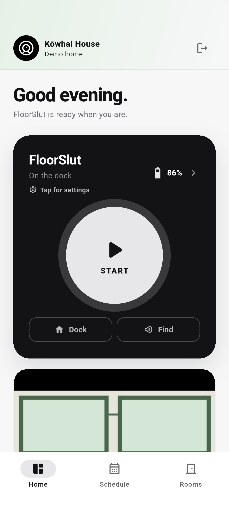
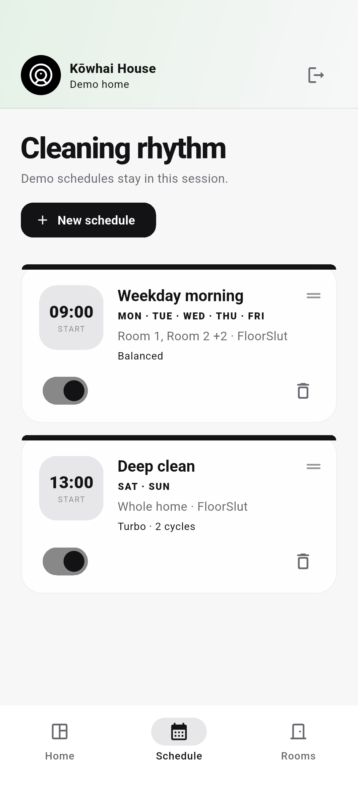
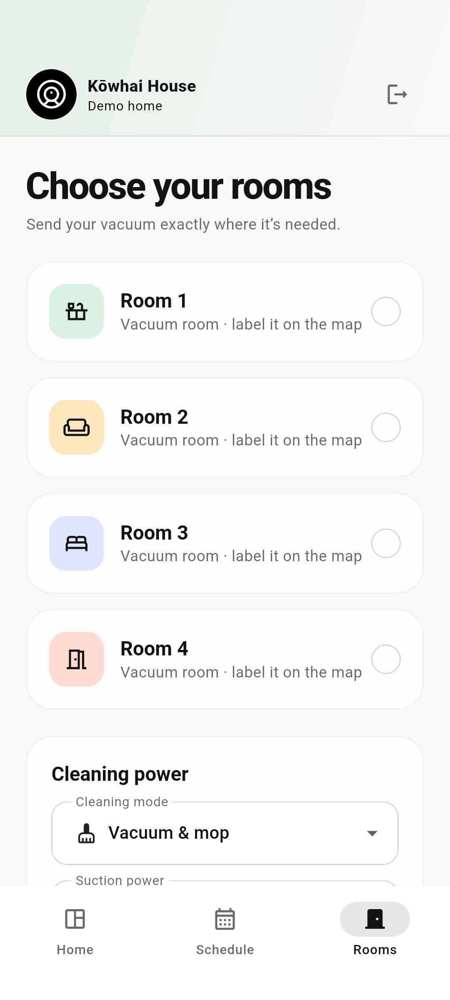
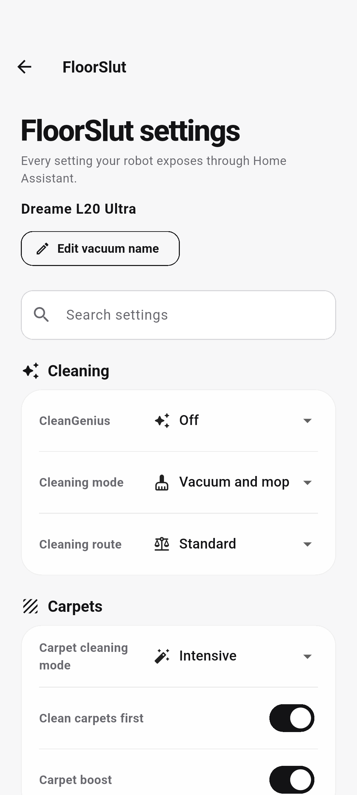
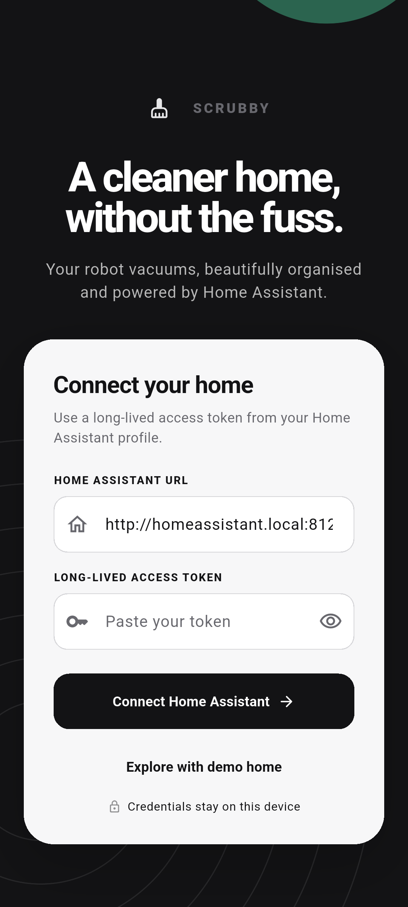

<div align="center">
  

# Scrubby

**Your robot vacuum, without the smart-home clutter.**

Scrubby is a focused, beautiful Home Assistant companion for robot vacuums—built for quick cleaning controls, live status, rooms, maps, schedules, and robot settings.

<p>
  <a href="https://github.com/brandonp2412/Scrubby/releases/latest"></a>
  <a href="https://github.com/brandonp2412/Scrubby/blob/main/LICENSE"></a>
</p>
</div>

## Clean without the clutter

- Start, pause, return to base, and locate compatible robot vacuums
- See live cleaning state, battery level, fan speed, and compatible floor maps
- Label rooms and launch supported room-cleaning actions
- Create and manage cleaning schedules
- Control model-specific settings exposed by Home Assistant
- Receive Android notifications for supported Dreame cleaning, consumable, information, warning, and error events
- Connect directly to your Home Assistant server—Scrubby has no cloud service, ads, or analytics
- Explore the complete interface with demo data before connecting a real home

## Screenshots

<p align="center">
  
  
  
  
  
</p>

## Get Scrubby

Scrubby is released and tested for **Android, Linux, Windows, and the web**. Apple platforms are not currently supported.

Download packaged builds from the [latest GitHub release](https://github.com/brandonp2412/Scrubby/releases/latest), or build from source:

```sh
flutter pub get
flutter run
```

Choose **Explore with demo home** to try Scrubby without a server. To connect a real installation, enter your Home Assistant URL and a long-lived access token created at **Home Assistant → Profile → Security → Long-lived access tokens**.

## Privacy, security, and support

Scrubby connects directly to the Home Assistant server you choose. See [PRIVACY.md](PRIVACY.md) for data handling and [SECURITY.md](SECURITY.md) for vulnerability reporting.

Use the [issue tracker](https://github.com/brandonp2412/Scrubby/issues) for reproducible bugs and feature requests. Do not include Home Assistant URLs, access tokens, maps, or other private household data in reports.

Scrubby is maintained by its contributors. Contributions are welcome under the [MIT License](LICENSE).

## Trademarks and affiliation

Scrubby is an independent project and is not affiliated with, endorsed by, or sponsored by Home Assistant or Dreame. Home Assistant and Dreame are trademarks of their respective owners.
